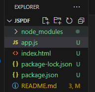

# JsPdf

## Pasos

### Paso 1

Instalar  jspdf y html2canvas.

```
npm install jspdf html2canvas
```


### Paso 2

Poner en en head los CDN de jspdf html2canvas.

```
<!-- Incluye jsPDF desde un CDN -->
<script src="https://cdnjs.cloudflare.com/ajax/libs/jspdf/2.4.0/jspdf.umd.min.js"></script>
    <!-- Incluye html2canvas desde un CDN -->
<script src="https://cdnjs.cloudflare.com/ajax/libs/html2canvas/1.4.1/html2canvas.min.js"></script>
```
### Paso 3

Se crea los siguientes archivos  JSON  y node



### Paso 4

Proceso de  generacion de pdf a travez de un boton.


HTML


```
 <div id="pdf-content">
        <h2>Información para el PDF</h2>
        <label for="name">Nombre:</label>
        <input type="text" id="name" placeholder="Tu nombre">
    
        <label for="email">Correo:</label>
        <input type="email" id="email" placeholder="Tu correo">
    </div>
<!-- Boton pagina HTML-->
<button onclick="generatePDF()">Generar PDF</button>
```

JS
```
 // Define la función generatePDF en el ámbito global
 const generatePDF = () => {
    const inputData = document.getElementById('pdf-content');
    
    if (!inputData) {
        console.error("Elemento 'pdf-content' no encontrado");
        return;
    }

    html2canvas(inputData).then(canvas => {
        const imgData = canvas.toDataURL('image/png');
        const { jsPDF } = window.jspdf;  // Obtiene jsPDF del CDN

        const pdf = new jsPDF({
            orientation: 'portrait',
            unit: 'px',
            format: 'a4'
        });

        pdf.addImage(imgData, 'PNG', 10, 10);
        pdf.save("document.pdf");
    }).catch(error => {
        console.error("Error al generar PDF:", error);
    });
};
```